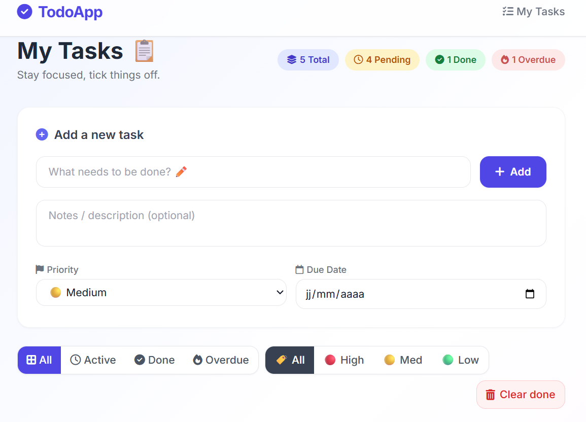
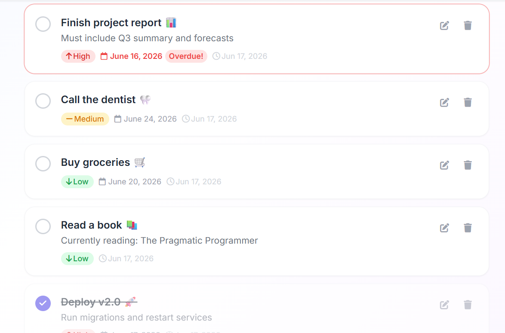

# AI Coding Agent

An agentic coding assistant powered by **Claude (Anthropic)** that autonomously reads, writes, and modifies a Django project based on natural language instructions.

---

## How It Works

The agent receives a user prompt, reasons about the steps needed, and executes them autonomously using a set of filesystem tools — no hand-holding required.

It is built on top of [`toyaikit`](https://github.com/datatalksclub/toyaikit) and uses Claude Sonnet via the Anthropic API.

---

## Tools Available

| Tool | Description |
|---|---|
| `read_file(path)` | Read a file's content |
| `write_file(path, content)` | Write/overwrite a file |
| `file_tree(path)` | Display the directory structure |
| `grep(pattern, path)` | Search for a pattern recursively |
| `run(command)` | Execute a bash command |

All operations are scoped to a **working directory** set at initialization.

---

## Stack

- **LLM:** `claude-sonnet-4-6` via Anthropic API
- **Framework:** Django 5.2.4 + TailwindCSS
- **Agent loop:** `toyaikit` — `AnthropicMessagesRunner`
- **Package manager:** `uv`
- **Database:** SQLite

---

## Usage

```python
from toyaikit.tools import Tools
from toyaikit.chat import IPythonChatInterface
from toyaikit.llm import AnthropicClient
from toyaikit.chat.runners import AnthropicMessagesRunner
import fs_ops

# Set up tools scoped to your project directory
fs = fs_ops.CodingAgentFS('my_project')
tools_obj = Tools()
tools_obj.add_tools(fs)

# Run the agent
chat_interface = IPythonChatInterface()
llm_client = AnthropicClient(model="claude-sonnet-4-6")

runner = AnthropicMessagesRunner(
    tools=tools_obj,
    developer_prompt=DEVELOPER_PROMPT,
    chat_interface=chat_interface,
    llm_client=llm_client
)

runner.run()
```

---

## Example Output

The following TodoApp was generated entirely by the agent from a single prompt, using the Django template + TailwindCSS:


